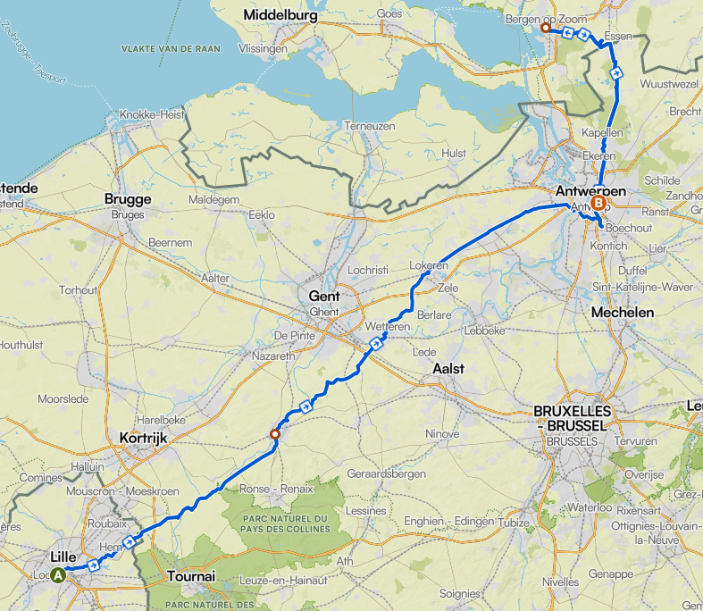

# ⸻

Here are a few photos from my very first bikepacking trip ! 

I was lucky to be introduced to bikepacking by my good friend François. He is a very experienced bikepacker, so I received great advice for my first trip.

For this adventure, I used my vintage Raymond Poulidor road bike, my first road bike. I fitted it with a small second-hand rear rack and strapped my tent and sleeping mat to it. Unfortunately, I also carried a backpack, which is something I would not recommend for any kind of cycling!!

<table>
  <tr>
    <td></td>
    <td></td>
  </tr>
  <tr>
    <td></td>
    <td></td>
  </tr>
</table>

  

<!-- Panzoom -->

Our route started in Lille, crossed Belgium, and ended in bergen\Bergen op Zoom, a seaside town in the Netherlands.

The trip covered about 230 km over three and a half days.

 | 

It was an amazing adventure, and I am very grateful to François for introducing me to bikepacking. That first trip got me hooked, and it was only the beginning !

<table>
  <tr>
    <td></td>
    <td></td>
  </tr>
</table>

