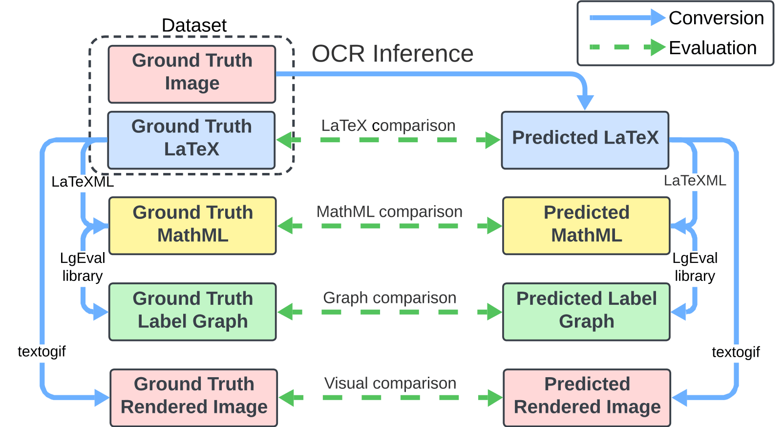
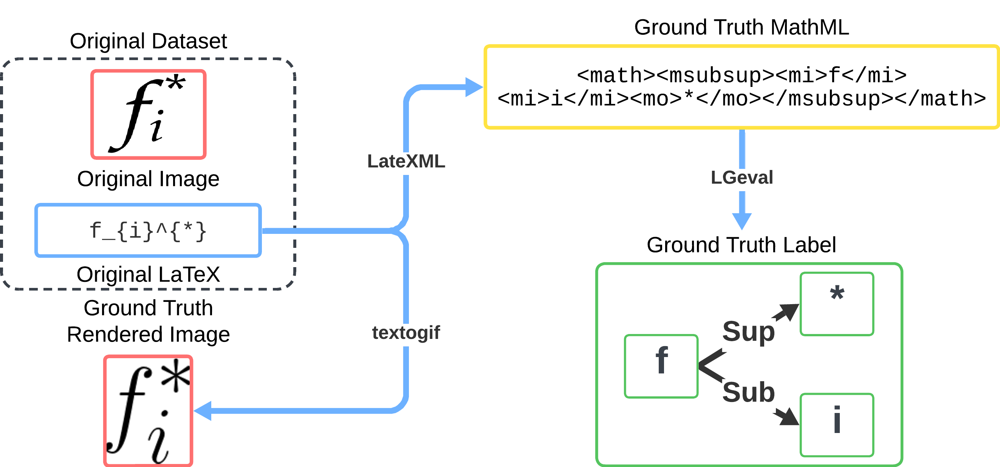

---

title: "PiE-MER: Multimodal Evaluation Pipeline for Mathematical Expression Recognition"

excerpt: "A comprehensive evaluation framework for printed mathematical expression recognition using multiple modalities: LaTeX, MathML, Label Graphs, and visual representations <br/>"

collection: portfolio

---


## A Multimodal Evaluation Pipeline for Mathematical Expression Recognition

The PiE-MER (Pipeline for Evaluation of Mathematical Expression Recognition) framework is part of the paper *A Multimodal Evaluation Pipeline for Mathematical Expression Recognition: Comparisons of Datasets, Metrics, and Models*, presented at ICDAR 2025. This evaluation pipeline provides a comprehensive methodology for assessing mathematical OCR systems using multiple complementary representations.

### The Problem with Current Evaluation Methods

Most Mathematical Expression Recognition (MER) systems are evaluated using traditional metrics like BLEU and Levenshtein distance on LaTeX strings alone. However, this approach suffers from **polymorphic ambiguity**, where different LaTeX expressions render identically (e.g., `x^{2}_{i}` and `x_i^2` both produce x²ᵢ) but are considered incorrect by string-based metrics. Additionally, evaluations typically focus only on syntactic accuracy, neglecting semantic correctness and visual fidelity.

 
*Complete conversion pipeline from raw dataset to multiple evaluation modalities*


## PiE-MER Architecture

The PiE-MER pipeline consists of:

1. **Image Rescaling**: Adaptive DPI adjustment to match model training specifications
2. **OCR Inference**: Running the model to generate LaTeX predictions
3. **Multimodal Conversion**: Converting both ground truth and predictions into all four modalities
4. **Metric Computation**: Computing 8+ metrics across modalities
5. **Analysis & Visualization**: Correlation analysis and heatmap generation

All conversions are handled robustly? if a conversion fails, empty strings receive the lowest evaluation scores.


## The Four Modalities of PiE-MER

The framework evaluates models across four complementary representations, each capturing different aspects of accuracy:

### 1. **LaTeX Modality** (Syntactic Accuracy)

The standard markup representation used by most MER systems. Evaluated using **LaTeX Levenshtein**, **LaTeX BLEU** and **Exact Match**.

### 2. **MathML Modality** (Structural and Semantic Accuracy)

Mathematical expressions converted to MathML using LaTeXML. This representation reduces polymorphic ambiguity inherent in LaTeX and provides more reliable evaluation.

Metrics include MathML Levenshtein and MathML BLEU scores.

### 3. **Label Graphs** (Structural and Semantic Accuracy)

Symbol-level graphs representing mathematical structure, extracted via LgEval. See the LgEval library: [LgEval](https://gitlab.com/dprl/lgeval)


### 4. **Visual Representation** (Visual Accuracy)

Normalized rendered images at 200 DPI, evaluated through:
- **Image Levenshtein**: Pixel column-based edit distance
- **Pixel Difference Ratio**: Pixel-wise comparison
- **Visual Exact Match**: Perceptual accuracy


*Converting a single mathematical expression into all four modalities*


## Key Findings

### Metric Correlations

Our correlation analysis revealed:

- **Image Levenshtein** (0.78) and **LaTeX Levenshtein** (0.52) show strongest alignment with true model accuracy (represented by the exact match metric)
- **BLEU scores** (<0.40 correlation) are weak predictors of actual performance
- **MathML normalization** is often more effective than LaTeX parsing at reducing ambiguity

### Critical Insights

1. **Preprocessing matters**: Parsed LaTeX and MathML normalization both significantly improve evaluation consistency
2. **No single metric suffices**: Combining visual + structural metrics provides robust evaluation
3. **Generalization varies**: MathNet excels accross multiple datasets, while some other models struggle outside of their training domain
4. **Real-world robustness**: Image DPI handling and rescaling significantly impact performance


*Model performance across all datasets and metrics. Darker cells indicate better performance.* 


## Recommended Metrics by Objective

Based on our correlation analysis, we recommend:

| Evaluation Goal | Primary Metrics | Secondary Metrics |
|-----------------|-----------------|-------------------|
| **Overall Quality** | Image Levenshtein, LaTeX Levenshtein | – |
| **Visual Similarity** | Image Levenshtein, Pixel Difference | Visual Exact Match |
| **Syntactic Accuracy** | LaTeX Levenshtein, ∆E_symlg | Exact Match |
| **Semantic Accuracy** | ∆E_symlg, MathML Levenshtein | MathML BLEU |


## Availability & Usage

PiE-MER is available as open-source software on GitHub, enabling researchers to evaluate their own MER models and datasets. For more information, please see:


**HAL ID**: hal-05172571  
**Full Paper**: [https://hal.science/hal-05172571](https://hal.science/hal-05172571)
- **PiE-MER GitHub**: [https://github.com/fwieckowiak/PiE-MER](https://github.com/fwieckowiak/PiE-MER)
- **Symbol Label Graph Library**: [https://gitlab.com/dprl/lgeval](https://gitlab.com/dprl/lgeval)


## Citation

```bibtex
@InProceedings{10.1007/978-3-032-04627-7_7,
author="Wieckowiak, Fran{\c{c}}ois
and Eglin, V{\'e}ronique
and Bonnet, Tony
and Bres, St{\'e}phane
and Rousseau, La{\"e}titia",
editor="Yin, Xu-Cheng
and Karatzas, Dimosthenis
and Lopresti, Daniel",
title="A Multimodal Evaluation Pipeline for Mathematical Expression Recognition: Comparisons of Datasets, Metrics, and Models",
booktitle="Document Analysis and Recognition --  ICDAR 2025",
year="2026",
publisher="Springer Nature Switzerland",
address="Cham",
pages="120--136",
isbn="978-3-032-04627-7"
}


```


## Funding & Acknowledgments

This work was carried out as part of a CIFRE PhD in collaboration between:
- **LIRIS** (Laboratoire d'Informatique en Image et Systèmes d'information, CNRS)
- **Luminess** (Industry partner)

CIFRE grant no. 2023/0356

---